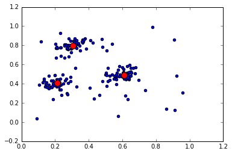

# AddC

Data-structure for online/streaming clustering of non-stationary data.

## Overview

This module implements an on-line (streaming) agglomerative clustering
algorithm (AddC) for non-stationary data as described in
[Guedalia et al.](http://www.cs.huji.ac.il/~werman/Papers/guedalia_etal99.pdf),
with modifications as given in [Zhang et al.](). Further improvements include
building the main AddC data-structure on top of the David Eppstein's dynamic
closest-pair algorithm/data-structure
([FastPair](https://github.com/carsonfarmer/fastpair)), and the ability to use
a [variety of different kernel functions](http://crsouza.blogspot.com/2010/03/kernel-functions-for-machine-learning.html).

The AddC algorithm is simple and fast. The algorithm can be summarized in the
following three steps: For each data point arriving;

1. Move the closest centroid towards the point.
2. Merge the two closest centroids. This results in the creation of a
   redundant centroid.
3. Set the redundant centroid equal to the new data point.

The algorithm can be understood as follows: Three criteria are addressed at
each time step, minimization of the within cluster variance, maximization of
the distances between the centroids, and adaptation to temporal changes in
the distribution of the data. In the first step the within-cluster variance
is minimized by up-dating the representation in a manner similar to the well-
known k-means algorithm. The second step maximizes the distances between the
centroids by merging the two centroids with the minimum distance (not
considering their weight). The merging is similar to most agglomerative methods.
Finally non-stationarity in the data generating process is anticipated by
treating each new point as an indication to a potential new cluster.

There are other Python versions
[here](https://github.com/marionleborgne/machine_learning) and
[here](http://gromgull.net/blog/2009/08/online-clustering-in-python/)
that also look pretty cool.

## Installation

[](https://travis-ci.org/carsonfarmer/AddC) [](https://coveralls.io/github/carsonfarmer/addc?branch=master)

`AddC` has not yet been uploaded to [PyPi](https://pypi.python.org/pypi),
as we are currently at the 'pre-release' stage\*. Having said that you should be
able to install it via `pip` directly from the GitHub repository with:

```bash
pip install git+git://github.com/carsonfarmer/addc.git
```

You can also install `AddC` by cloning the
[GitHub repository](https://github.com/carsonfarmer/addc) and using the
setup script:

```bash
git clone https://github.com/carsonfarmer/addc.git
cd addc
python setup.py install
```

\* *This means the API is not set, and subject to crazy changes at any time!*

## Testing

`AddC` comes with a <del>comprehensive</del> preliminary range
of tests. To run the tests, you can use [`py.test`](http://pytest.org/latest/)
(maybe also `nosetests`?), which can be installed via `pip` using the
`recommended.txt` file (note, this will also install some other stuff (`numpy`,
`scipy`, `matplotlib`, and `IPython`) which are all great and useful for
tests and examples):

```bash
pip install -r recommended.txt
py.test addc
```

## Features

In the following examples we use the `random` module to generate data.

```python
from addc import AddC
import random

def rand_normal(center=(0, 0), sd=0.02):
    return tuple([random.normalvariate(m, sd) for m in center])

def cluster_data(n=50, means=[(.6, .5), (.3, .8), (.2, .4)], sd=0.02):
    # random.seed(8714)
    data = [rand_normal(mean, sd) for _ in range(n) for mean in means]
    data += [rand_tuple() for _ in range(n//2)]  # Noise
    return data
```

### Basics

The simplest way to use a `AddC` data-structure is to initialize one
and then update it with data points (via the `+=` operator). In this first
example, we create 3 clusters each with 50 2D Gaussian random points and
add them to an `AddC` object:

```python
means = [(.6, .5), (.3, .8), (.2, .4)]
points = cluster_data(50, means=means, sd=0.05)
# Create empty data-structure with `kmax=10` and
# using a Gaussian-kernel-induced distance metric
ac = AddC(10).batch(points)  # Add points all at once...
```

Users can then add additional points, and start to query the data-structure for
clusters. As points are added, the data-structure responds and updates
accordingly
(see [this paper](http://www.cs.huji.ac.il/~werman/Papers/guedalia_etal99.pdf)
for details).

`AddC` has minimal properties and methods, and is mostly intended for purely
on-line agglomerative clustering. Users can query the data-structure for its
size (i.e., how many clusters it has found, which is usually equal to `kmax`),
testing for containment of a given centroid, its current set of centroids,
as well as methods for batch processing of new points, and trimming excess
centroids. By default, this uses the trimming technique outlined in Guedalia
et al., though a custom version is also available:

```python
len(fp)  # Total number of centroids... probably equal to kmax
fp.centroids[0] in fp
fp.npoints  # Total number of points seen so far

centroids = ac.trim(0.2)
len(centroids)
```

To illustrate the use of this data-structure, here is an example plot using
the `cluster_data` from above:

```python
import matplotlib.pyplot as plt

plt.figure()
plt.scatter(*zip(*points))
plt.scatter(*zip(*ac.centroids), color="red", s=100)
plt.show()
```


## License

Copyright © 2016, [Carson J. Q. Farmer](http://carsonfarmer.com/)  
Licensed under the [MIT License](http://opensource.org/licenses/MIT).  
